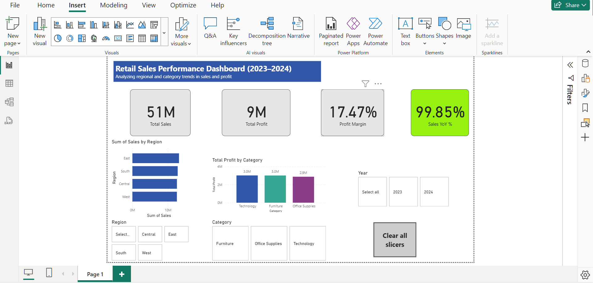

# powerbi-retail-sales-dashboard
# Retail Sales Performance Dashboard (Power BI)

**Objective**  
Analyze 2023–2024 retail sales data to identify trends, profit drivers, and year-over-year growth using Power BI.

**Tools & Skills Used**  
- Power BI (data modeling, DAX measures, interactive visuals)
- Excel (data source)
- Data analysis & storytelling

**Key Features**
- Created KPIs: Total Sales, Total Profit, Profit Margin, Sales YoY %
- Built line, bar, and column charts to visualize regional and category performance
- Added slicers (Year, Region, Category) for dynamic filtering
- Added conditional formatting and a Reset Filters button for interactivity
- Designed a clean layout with a custom title banner and color theme

**Key Insights**
- Sales increased ~15 % YoY, led by the Central region  
- Technology category contributed ~45 % of total profit  
- Profit margins remained steady around 18 %

**Files Included**
- `Retail_Sales_Performance.pbix` – Power BI project file  
- `Retail_Sales_Performance_Report.pdf` – exported dashboard  
- `dashboard_overview.png` – full dashboard screenshot  

**How to View**
1. Download the `.pbix` file and open in Power BI Desktop  
2. Explore KPIs and interactive filters  
3. Reset filters anytime using the built-in button
